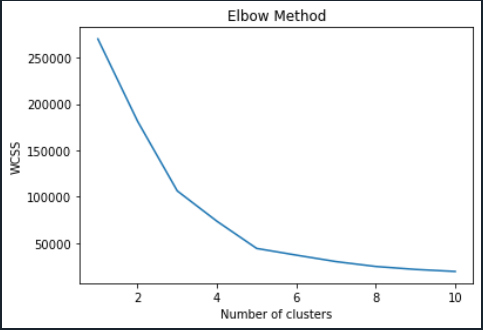
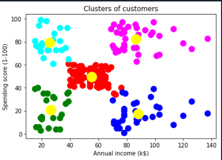

# Clustering-Algorithms-ML
Implementation of Clustering Algorithms used in Machine Learning.
Clustering is one of the most common exploratory data analysis technique used to get an intuition about the structure of the data. It can be defined as the task of identifying subgroups in the data such that data points in the same subgroup (cluster) are very similar while data points in different clusters are very different. In other words, we try to find homogeneous subgroups within the data such that data points in each cluster are as similar as possible according to a similarity measure such as euclidean-based distance or correlation-based distance. The decision of which similarity measure to use is application-specific.

___

# Installations 

```python
    pip install pandas
    pip install numpy
    pip install matplotlib

```
___
# TABLE OF CONTENTS
| S.N 	| Clustering Algorithm   	| Dataset Used       	|
|-----	|------------------------	|--------------------	|
| 1.  	| K-Means Clustering     	| Mall_Customers.csv 	|
| 2.  	| Hierarchial Clustering 	| Mall_Customers.csv 	|

___

## K-Means Clustering Algorithm   
K-Means algorithm is an iterative algorithm that tries to partition the dataset into Kpre-defined distinct non-overlapping subgroups (clusters) where each data point belongs to only one group. It tries to make the intra-cluster data points as similar as possible while also keeping the clusters as different (far) as possible. It assigns data points to a cluster such that the sum of the squared distance between the data points and the cluster’s centroid (arithmetic mean of all the data points that belong to that cluster) is at the minimum. The less variation we have within clusters, the more homogeneous (similar) the data points are within the same cluster.

**Process:**
1. Specify number of clusters K.
2. Initialize centroids by first shuffling the dataset and then randomly selecting K data points for the centroids without replacement.
3. Keep iterating until there is no change to the centroids. i.e assignment of data points to clusters isn’t changing.

**Selection of right number of clusters:**   
One measurement is Within Cluster Sum of Squares (WCSS), which measures the squared average distance of all the points within a cluster to the cluster centroid. To calculate WCSS, you first find the Euclidean distance (see figure below) between a given point and the centroid to which it is assigned. You then iterate this process for all points in the cluster, and then sum the values for the cluster and divide by the number of points. Finally, you calculate the average across all clusters. This will give you the average WCSS.   

**Observation after application of WCSS**   


## Steps Involved:   

1. Import the Libraries. 
2. Import the datasets.
3. Using the elbow method to determine the number of clusters.
4. Training the dataset on K-Means Model.
5. Visualising the clusters.

## Observation:   

   

___


